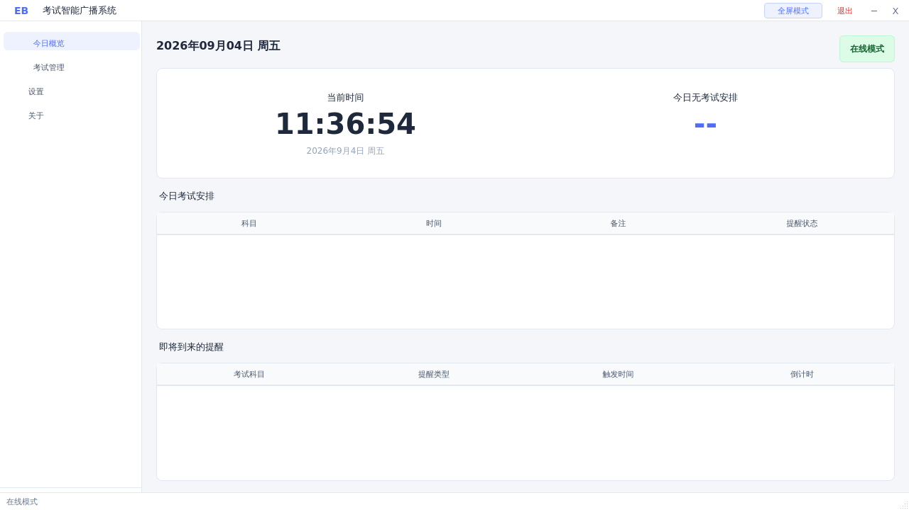
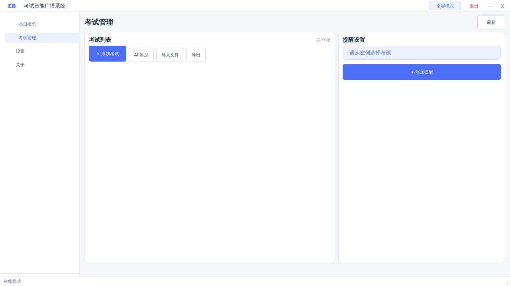
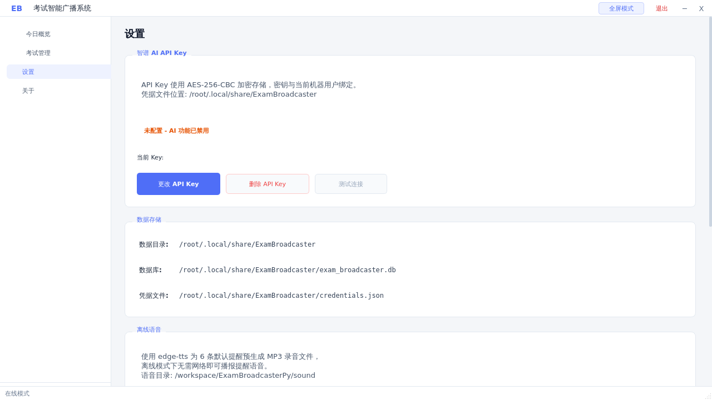
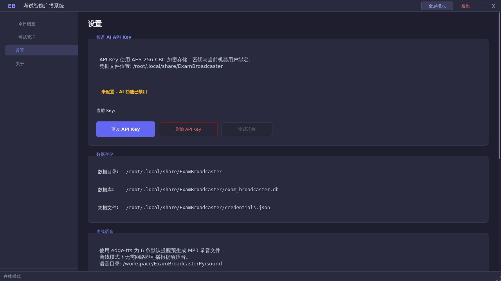
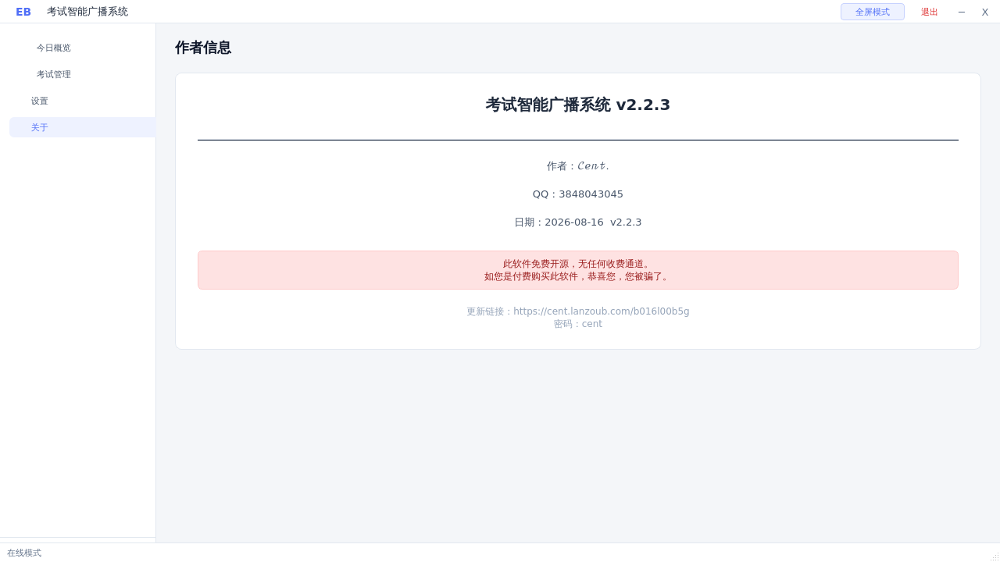

# 考试智能广播系统 (ExamBroadcasterPy)

> 面向学校考场场景的智能语音广播与考试提醒桌面应用，基于 PyQt6 构建，支持 AI 语音生成、离线语音、定时播报、全屏广播与深浅双主题。

版本：`v2.2.3`

## 功能特性

- **考试提醒调度**：按考试开始、结束、结束前 15/5 分钟等关键节点定时语音播报；对超短时考试自动禁用逻辑上不可能的提醒，避免误播。
- **考试静默窗口**：考试开始前 30 分钟至结束后 5 分钟内全局静音（考试提醒除外），不打扰考场。
- **AI 语音生成**：接入智谱 GLM-4-Flash 生成广播文案，配合 edge-tts 合成自然语音，一键接入。
- **离线语音**：预置考试开始/结束铃声与常用广播语音包，断网环境仍可正常播报；缺失语音可一键补齐。
- **Excel 导入**：解析考试安排表，批量建立考试与提醒。
- **全屏广播**：无边框全屏 + 置顶 + 自动隐藏任务栏，进入即切换「今日概览」，配合系统唤醒限制保持屏幕常亮。
- **自定义界面**：无边框窗口 + 侧边栏导航 + 深浅双主题，切换时全部背景与文字颜色完整联动。
- **平滑动画**：页面切换采用整页淡入过渡，内容容器实心主题底色，杜绝黑屏/残影；侧边栏选中高亮为几何滑块动画。
- **静音提示**：除考试提醒外，所有信息/警告/确认均用无系统音效的自绘 Toast，不打断课堂。
- **托盘常驻**：最小化到系统托盘后台静默运行，附退出二次确认防误触。
- **启动屏**：内置品牌背景图与图标，加载步骤可视化，深浅模式自适应。

## 项目截图

**今日概览（浅色）**



**考试管理（浅色）**



**设置页（浅色）**



**设置页（深色）**



**关于页**



## 安装与运行

环境要求：Python 3.10+，Windows 10/11（推荐；Linux/macOS 可运行但未深度适配）。

```bash
git clone <仓库地址>
cd ExamBroadcasterPy
pip install -r requirements.txt
python app.py
```

首次运行会在用户数据目录下自动创建数据库：
- Windows: `%LOCALAPPDATA%\ExamBroadcaster\`
- macOS: `~/Library/Application Support/ExamBroadcaster/`
- Linux: `~/.local/share/ExamBroadcaster/`

**API Key 配置**：启动后在「设置 → 智谱 AI API Key」填入 Key，程序使用 AES-256 加密落盘，明文不存储。未配置时 AI 功能自动禁用，离线语音仍不受影响。

## 协议

本项目采用 [MIT License](./LICENSE) 开源，免费使用，无任何收费通道。